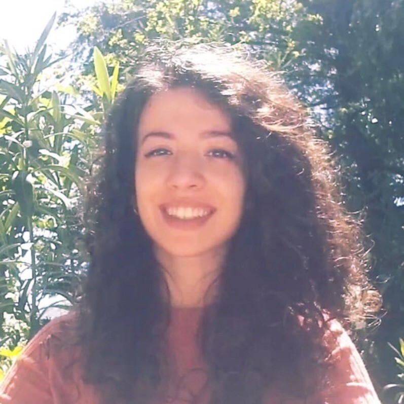

<!DOCTYPE html>
<html lang="en">
<head>
<meta charset="UTF-8">
<meta name="viewport" content="width=device-width, initial-scale=1.0">
<title>Erica Coppolillo — Researcher</title>
<link rel="preconnect" href="https://fonts.googleapis.com">
<link rel="preconnect" href="https://fonts.gstatic.com" crossorigin>
<link href="https://fonts.googleapis.com/css2?family=DM+Sans:ital,opsz,wght@0,9..40,300;0,9..40,400;0,9..40,500;1,9..40,300&family=DM+Serif+Display:ital@0;1&display=swap" rel="stylesheet">

</head>
<body>

<nav>
  

    <a href="#" class="nav-name">Erica Coppolillo</a>
    <ul class="nav-links">
      <li><a href="#research">Research</a></li>
      <li><a href="#publications">Publications</a></li>
      <li><a href="#teaching">Teaching</a></li>
      <li><a href="#experience">Experience</a></li>
      <li><a href="#contact">Contact</a></li>
    </ul>
  

</nav>

  <!-- HERO -->
  

    

    

      
Postdoctoral Researcher · ICAR-CNR, Italy

      <h1>Erica Coppolillo </h1>

      

        I study the intersection of AI and social networks, understanding how algorithms shape opinion, engagement, and information dynamics in online communities.
      

      

        <a href="Extended%20English%20CV.pdf" download="Erica_Coppolillo_CV.pdf" target="_blank" class="btn btn-primary">Curriculum Vitae ↓</a>
        <a href="https://scholar.google.com/citations?user=XagpT-oAAAAJ" target="_blank" class="btn btn-ghost">Google Scholar</a>
        <a href="https://www.linkedin.com/in/erica-coppolillo-8683301b1/" target="_blank" class="btn btn-ghost">LinkedIn</a>
      

    

<!--      
<!--        width: 150px;-->
<!--        height: 150px;-->
<!--        top: 5rem;-->
<!--        right: 10rem;-->
<!--        border-radius: 50%;-->
<!--        object-fit: cover;-->
<!--        object-position: center top;-->
<!--        flex-shrink: 0;-->
<!--        border: 3px solid #ff9898;-->
<!--    ">-->
      

        
  

  <!-- RESEARCH -->
  <section id="research">
    

      Research interests
      

    

    <h2>At the edge of AI and society</h2>
    

      My work spans recommender systems, large language models, and the societal implications of AI, with a particular focus on algorithmic bias, opinion dynamics and social network analysis. I also study the intersection between deep learning and knowledge representation.
    

    

      Large Language Models
      Social Network Analysis
      Recommender Systems
      Algorithmic Bias
      Opinion Dynamics
      Knowledge Representation
      Deep Learning
    

  </section>

  <!-- PUBLICATIONS -->
  <section id="publications">
    

      Selected publications
      

    

    <h2>Recent work</h2>
    

      

        

          
2026

          
Fine-tuning LLMs for Answer Set Programming

          
Erica Coppolillo, Francesco Calimeri, Giuseppe Manco, Simona Perri and Francesco Ricca

          
Journal of Intelligent Information Systems

        

        Journal
      

      

        

          
2026

          
MOSAIC: Unveiling the Moral, Social and Individual Dimensions of Large Language Models

          
Erica Coppolillo and Emilio Ferrara

          
arXiv

        

        Preprint
      

      

        

        
2026

          
Harm in AI-Driven Societies: An Audit of Toxicity Adoption on Chirper.ai

          
Erica Coppolillo, Luca Luceri and Emilio Ferrara

          
arXiv

        

        Preprint
      

      

        

          
2025

          
Women who hate men: a comparative analysis across extremist Reddit communities

          
Erica Coppolillo

          
Scientific Reports

        

        Journal
      

      

        

          
2025

          
Unmasking conversational bias in ai multiagent systems

          
Erica Coppolillo, Giuseppe Manco and Luca Maria Aiello

          
arXiv

        

        Preprint
      

      

        

          
2025

          
Engagement-Driven Content Generation with Large Language Models

          
Erica Coppolillo, Federico Cinus, Marco Minici, Francesco Bonchi and Giuseppe Manco

          
ACM SIGKDD Conference on Knowledge Discovery and Data Mining (KDD)

        

        Conference
      

      

        

          
2025

          
Algorithmic Drift: A Simulation Framework to Study the Effects of Recommender Systems on User Preferences

          
Erica Coppolillo, Simone Mungari, Francesco Fabbri, Marco Minici, Francesco Bonchi and Giuseppe Manco

          
Information Processing &amp; Management

        

        Journal
      

      

        

          
2025

          
Relevance meets diversity: A user-centric framework for knowledge exploration through recommendations

          
Erica Coppolillo, Giuseppe Manco and Aristides Gionis

          
ACM SIGKDD Conference on Knowledge Discovery and Data Mining (KDD)

        

        Conference
      

      

        

          
2024

          
Balanced Quality Score (BQS): Measuring Popularity Debiasing in Recommendation

          
Erica Coppolillo, Marco Minici, Ettore Ritacco, Luciano Caroprese, Francesco Pisani and Giuseppe Manco

          
ACM Transactions on Intelligent Systems and Technology

        

        Journal
      

      

        

          
2024

          
LLASP: Fine-tuning Large Language Models for Answer Set Programming

          
Erica Coppolillo, Francesco Calimeri, Giuseppe Manco, Simona Perri and Francesco Ricca

          
International Conference on Principles of Knowledge Representation and Reasoning (KR)

        

        Conference
      

    

    

      <a href="https://scholar.google.com/citations?user=XagpT-oAAAAJ" target="_blank" class="btn btn-ghost">View all on Google Scholar →</a>
    

  </section>

  <section id="teaching">
  

    Teaching
    

  

  <h2>Teaching activity</h2>
  

    

      
2023 – present

      

        
Teaching Assistant

        
University of Calabria, Rende

        
"Elementi di Informatica Teorica" course, at the Department of Mathematics and Computer Science.

        

          
🎓

          

            Are you a student looking for a <strong>thesis</strong>? If you are interested in exploring any of my research topics, feel free to <a href="#contact">get in touch</a>!
          

        

      

    

     

      
2023

      

        
"Coding Girls" Tutoring
        

        
Liceo Scientifico "Fermi", Cosenza

        
Tutoring in "Coding Girls" Project, supported by "Fondazione Digitale".

      

    

  

  <!-- EXPERIENCE -->
 <section id="experience">
  

    Experience
    

  

  <h2>Academic path</h2>
  

    

      
2026 – present

      

        
Postdoctoral Researcher

        
ICAR-CNR, Rende

        
Research on LLMs, social dynamics, and algorithmic bias at the Institute for High Performance Computing and Networking.

      

    

    

      
2022 – 2026

      

        
PhD Student

        
University of Calabria &amp; ICAR-CNR

        
Doctoral research on recommender systems, LLMs, algorithmic bias, and social dimensions of AI. Advised by F. Calimeri, G. Manco, and S. Perri.

        

          

            2025 – 2026
            Visiting Scholar · USC, Los Angeles
            6 months advised by Emilio Ferrara and Luca Luceri, on detrimental phenomena induced by LLM-based agents.
          

        

        

          

            2022 – 2023
            PhD Traineeship · KTH, Stockholm
            6 months advised by Aristides Gionis, on the relevance-diversity trade-off in recommendation.
          

        

      

    

    

      
2020 – 2022

      

        
MSc in Computer Science

        
University of Calabria, Rende, Italy

        
Graduate studies with specialization in Artificial Intelligence and Cybersecurity.

        

          

            2022
            Erasmus Traineeship+ · Eurecat, Barcelona
            4 months advised by Francesco Bonchi, on the long-term social impact of recommender systems.
          

        

      

    

    

      
2017 – 2020

      

        
BSc in Computer Science

        
University of Calabria

        
Undergraduate studies in Computer Science.

      

    

  

       

      <a href="Extended%20English%20CV.pdf" target="_blank" class="btn btn-ghost">Download my CV ↓</a>
    

</section>

  <!-- CONTACT -->
  <section id="contact">
    

      Contact
      

    

    

      

        <h2>Get in touch</h2>
        

          I am always open to discussing research, potential collaborations, or opportunities within the AI community. Feel free to reach out!
        

      

      

        <a href="mailto:erica.coppolillo@icar.cnr.it" class="contact-link">
          
✉

          

            
Email

            
erica.coppolillo@icar.cnr.it

          

        </a>
        <a href="https://www.icar.cnr.it/en/persone/coppolillo/" target="_blank" class="contact-link">
          
🏛

          

            
Institution

            
ICAR-CNR, Rende, Italy

          

        </a>
        <a href="https://www.linkedin.com/in/erica-coppolillo-8683301b1/" target="_blank" class="contact-link">
          
in

          

            
LinkedIn

            
erica-coppolillo

          

        </a>
      

    

  </section>

<footer>
  
Erica Coppolillo · Postdoctoral Researcher · ICAR-CNR · Updated June 2026

</footer>

</body>
</html>
